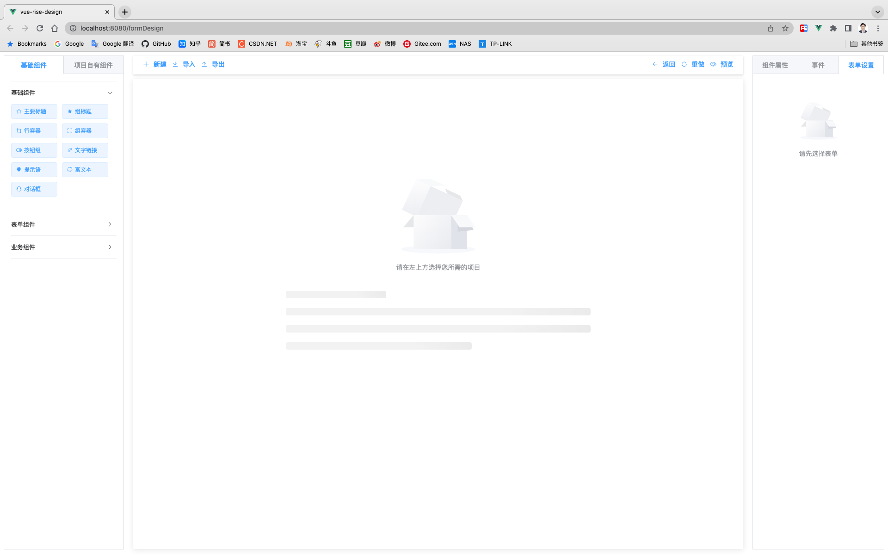

## Rise 渲染器模版项目

> 一款能真正满足业务需求的前端表单设计器



[Demo](https://max_law.gitee.io/rise-desgin/)｜[Gitee](https://gitee.com/max_law)｜[Gitee 文档](https://max_law.gitee.io/rise-document/)｜[GitHub](https://github.com/Max-Law)

## 特点

- 拖拽形式生成表单页面，减少重复性工作；
- 支持 PC 端、移动端，一次设计多端应用；
- 含有模块、模版、页面模式，支持业务复用和继承；
- 丰富的表单组件，表格、组容器、级联选择、对话框弹窗等等，经历大量的业务测试；
- 组件支持响应式栅格，行内 style 编写，布局更为精致；
- 可插入用户自定义组件，灵活度大大提高；
- 更为全面的校验功能，正则、触发动作、类型、空格、异步校验，函数校验，同时内置了 12 种常用校验（手机号、邮箱、金额...）以供选择；
- 支持组件获取远端数据动态生成下拉列表等；
- 支持编写脚本，实现组件联间动，包含 change、blur、focus、input 等事件；
- 可编写事件监听，支持多个值同时绑定一个函数并含有深度监听与立刻执行功能；
- 数据绑定形式不止单层，支持双层数据绑定，减少因数据库表重复属性名带来的问题；
- 全面的表单生命周期钩子函数：构建前事件（异步）、构建后事件、数据填入后事件、提交前事件（异步）、提交后事件；
- 采用 VueX 作为表单数据管理，增强了与外部通信能力；
- 渲染器兼容 IE 浏览器；

## 项目结构

整个 Rise 前端低代码平台分为两个插件：设计器（vue-rise-design）、渲染器（vue-rise-realize）

渲染的组件为：`<bm-form-design>` 与 `<bm-form-realize>`

底层依赖为：

| 依赖包     | 版本    |
| ---------- | ------- |
| vue        | ^2.6.14 |
| vue-router | ^3.5.1  |
| vuex       | ^3.6.2  |

功能依赖：

| 功能         | 依赖包                  |
| ------------ | ----------------------- |
| Ajax         | axios                   |
| UI           | element-ui              |
| 富文本       | wangeditor              |
| 页面编辑器   | monaco-editor           |
| 拖拽         | vuedraggable            |
| 中国地区数据 | element-china-area-data |

## 设计思路

整个表单是由 formConfig 与 formData 两个对象构成，顾名思义 formConfig 是负责描述表单结构，formData 负责处理用户数据。

### formConfig

```
{
    "formAttributes": {},
    "type": "page",
    "column": [
        {
            "type": "form-title",
            "grade": "brick",
            "id": "prop_1663573674132",
            "prop": "prop_1663573674132"
        },
        {
            "type": "group-container",
            "grade": "frame",
            "id": "prop_1663573678702",
            "prop": "prop_1663573678702",
            "column": [
                {
                    "type": "input",
                    "grade": "lego",
                    "id": "prop_1663573680825",
                    "prop": "prop_1663573680825"
                },
                {
                    "formItem": {
                        "offset": 1
                    },
                    "prop": "prop_1663573684658",
                    "type": "form-select",
                    "grade": "lego",
                    "id": "prop_1663573684658"
                }
            ]
        }
    ],
    "formEvent": {
        "beforeCreate": "",
        "created": "",
        "dataFilled": "",
        "beforeSubmit": "",
        "submited": "",
        "watchList": []
    }
}
```

由上面的例子可以看出每个组件都是由其描述 json 生成的，主要包括以下属性：

| 属性   | 含义                           |
| ------ | ------------------------------ |
| type   | 组件类型                       |
| grade  | 组件级别（lego、brick、frame） |
| id     | 组件的唯一标识                 |
| prop   | 绑定的数据键                   |
| column | 子组件数列                     |
| etc.   | ...                            |
